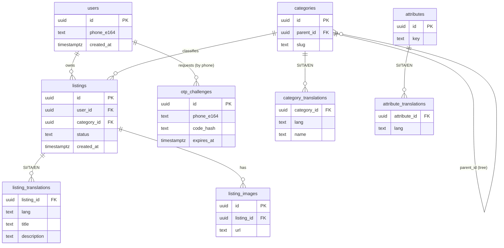
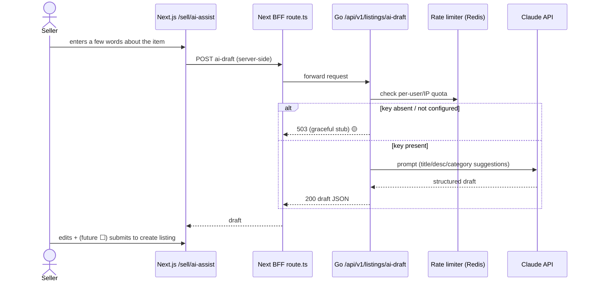
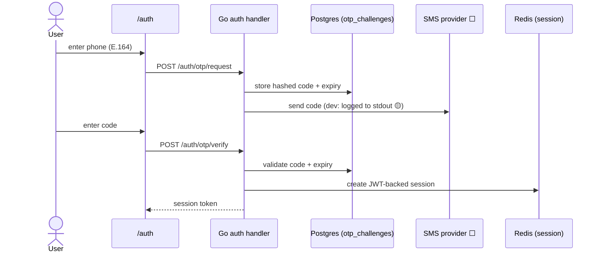
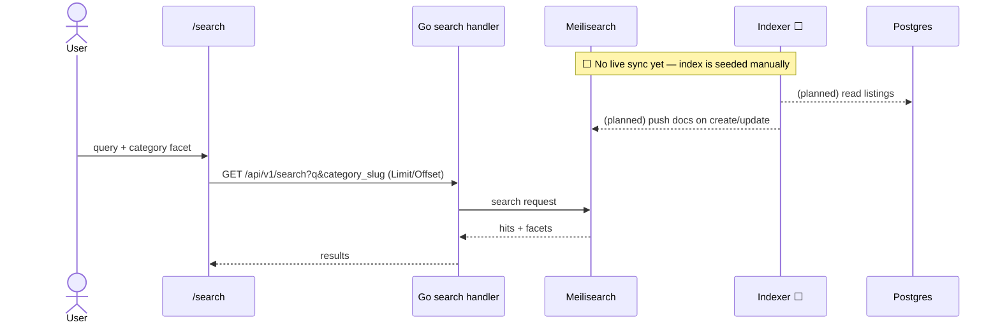
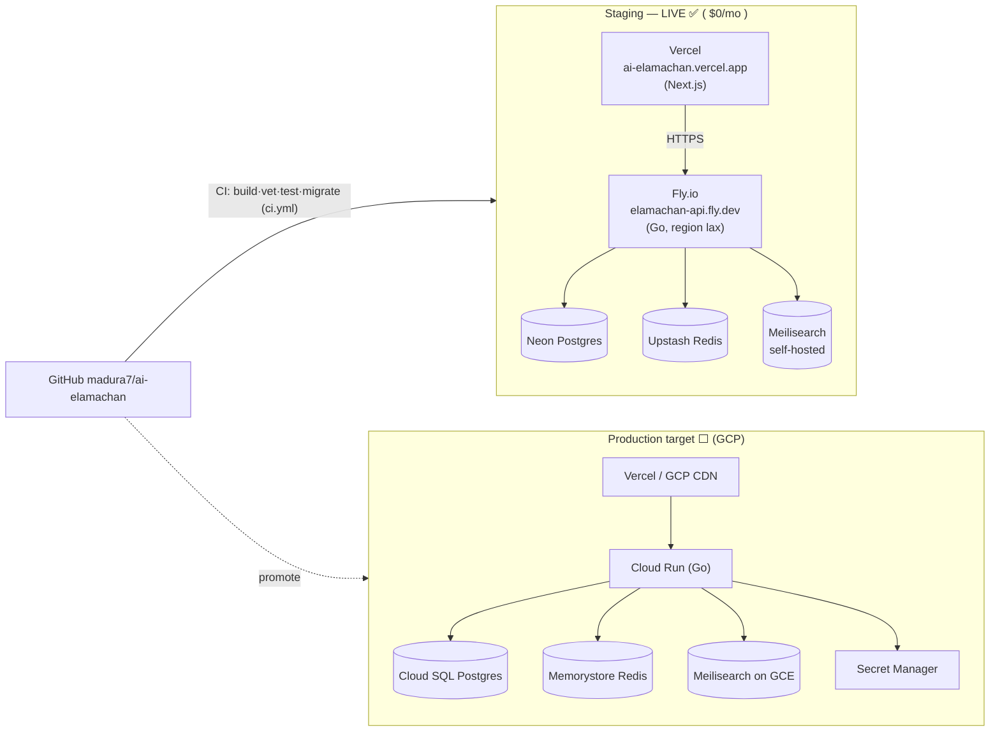

# ElaMachan — System Architecture (VER-227)

> Classified marketplace for the Sri Lankan market (modeled on ikman.lk), with
> **AI-assisted listing creation** (Claude API) as the headline feature. Trilingual
> (Sinhala / Tamil / English). Monorepo: Next.js frontend + Go backend.

**Status legend used throughout:**

| Marker | Meaning |
| --- | --- |
| ✅ **Implemented** | Code is on `main` and served by the live staging environment |
| 🟡 **Partial / gated** | Endpoint or UI exists but is stubbed, degraded, or blocked on a dependency |
| ⬜ **Planned** | Designed / in roadmap, **not yet built** |

Diagrams are [Mermaid](https://mermaid.js.org/) — they render natively in GitHub,
VS Code, and most markdown viewers.

---

## 1. System Context & Components (C4-ish)

Shows every layer including features not yet built. Dashed nodes = **planned**.

```mermaid
flowchart TB
    user(["👤 Buyer / Seller<br/>(SI / TA / EN)"])

    subgraph FE["Frontend — Next.js 15 App Router (Vercel) ✅"]
        direction TB
        home["/  Home + browse 🟡"]
        auth["/auth + /auth/verify<br/>phone OTP ✅"]
        dash["/listings dashboard ✅"]
        search_ui["/search faceted ✅"]
        sell["/sell/ai-assist ✅"]
        detail["/listings/:id detail ⬜"]
        create["/sell create + edit form ⬜"]
        mw["middleware.ts — i18n locale ✅"]
        client["lib/api typed client<br/>(generated from OpenAPI) ✅"]
        bff["/api/listings/ai-draft<br/>Next BFF proxy ✅"]
    end

    subgraph BE["Backend — Go HTTP API (Fly.io: elamachan-api) ✅"]
        direction TB
        health["GET /healthz ✅"]
        otp_req["POST /api/v1/auth/otp/request ✅"]
        otp_vrf["POST /api/v1/auth/otp/verify ✅"]
        ai["POST /api/v1/listings/ai-draft 🟡 (key-gated)"]
        list_r["GET /api/v1/listings ✅"]
        cat_r["GET /api/v1/categories ✅"]
        srch_r["GET /api/v1/search ✅"]
        list_w["POST/PATCH /api/v1/listings<br/>create + edit ⬜"]
        img_w["POST /api/v1/listings/:id/images ⬜"]
        indexer["Postgres → Meilisearch<br/>indexer / sync ⬜"]
    end

    subgraph DATA["Data & infra"]
        pg[("Postgres ✅<br/>Neon (staging)")]
        redis[("Redis ✅<br/>Upstash — sessions,<br/>rate-limit, cache")]
        meili[("Meilisearch ✅<br/>search index")]
        blob[("Object storage ⬜<br/>listing images")]
    end

    subgraph EXT["External services"]
        claude["Claude API ✅<br/>(AI listing draft)"]
        sms["SMS/OTP provider ⬜<br/>VER-44 (dev: stdout stub)"]
        secrets["Secret manager 🟡<br/>GCP SM @ prod / env @ staging"]
        pay["Payments / promotions ⬜"]
    end

    user --> FE
    home & dash & search_ui --> client
    auth --> client
    sell --> bff
    client -->|HTTPS JSON| BE
    bff -->|server-side| ai

    otp_req & otp_vrf --> pg
    otp_req --> sms
    otp_vrf --> redis
    ai --> claude
    list_r & cat_r --> pg
    srch_r --> meili
    list_w --> pg
    img_w --> blob
    indexer --> pg
    indexer --> meili
    BE --> secrets
    pay -.future.-> BE
```

---

## 2. Data Model (current schema — migrations `0001`, `0002`)

All ✅ tables exist on `main`. Trilingual content is stored via `*_translations`
side tables keyed by `lang` (ADR 0001).

> **Not yet wired:** listing↔attribute *values* (faceted attribute storage on a
> listing) and any image bytes pipeline — `listing_images` holds URLs but there is
> no upload/storage path yet (see §1 `blob` and `img_w`).

---

## 3. Key Request Flows

### 3a. AI-assisted listing draft ✅🟡 (headline feature)

### 3b. Phone OTP auth ✅ (SMS delivery ⬜)

### 3c. Search & browse ✅ (indexer ⬜)

---

## 4. Deployment Topology

Staging is live today on an all-free-tier stack (VER-188). **Production target is
GCP** per the project brief — shown side-by-side below.

**CI/CD ✅:** every PR runs `.github/workflows/ci.yml` (Go build/vet/test, frontend
lint/build, migration apply check on throwaway Postgres). Merge to `main`
auto-deploys backend → Fly and frontend → Vercel.

---

## 5. Implementation Status Summary

| Capability | Status | Notes / tracking |
| --- | --- | --- |
| Phone OTP auth + JWT/Redis sessions | ✅ | ADR 0002 |
| Real SMS delivery | ⬜ | **VER-44** — dev stub logs code to stdout |
| Categories read API + tree | ✅ | `GET /api/v1/categories` |
| Listings read API | ✅ | `GET /api/v1/listings` |
| Faceted search (Meilisearch) | ✅ | `GET /api/v1/search`, category facet |
| Meilisearch ingest/sync pipeline | ⬜ | no Postgres→Meili indexer yet |
| AI-assisted draft | 🟡 | endpoint live, **key-gated** (VER-45 / VER-69) |
| Listing create / edit write API | ⬜ | only read + ai-draft exist today |
| Image upload + object storage | ⬜ | `listing_images` holds URLs only |
| Listing detail page | ⬜ | VER-132 |
| Home / browse UI | 🟡 | VER-131 |
| Search / auth / dashboard / sell UI | ✅ | VER-189 (typed client) |
| Trilingual UI (SI/TA/EN) | ✅ | `middleware.ts` + `lib/i18n` |
| Payments / promotions | ⬜ | future surface (merge policy) |
| Trust / fraud logic | ⬜ | future surface |
| Production (GCP) deploy | ⬜ | staging on Fly+Vercel today |

---

## 6. Cross-cutting design notes

- **Graceful degradation:** every optional-dependency route (ai-draft, auth,
  listings, search) returns a structured **503** when its backing service (Claude
  key, DB, `MEILI_URL`) is absent, instead of failing to boot. Lets the API run in
  partial environments.
- **Typed contract:** frontend talks to the backend exclusively through a client
  **generated from the OpenAPI spec** (ADR 0003) — no hand-written API layer
  (`lib/api.ts` was deleted in VER-189). A CI `api:check` gate enforces drift-free
  types.
- **i18n storage:** all user-facing content lives in `*_translations` tables keyed
  by `lang` (ADR 0001) rather than columns-per-language.
- **Secrets:** Claude key / DB creds / JWT secret via GCP Secret Manager at prod,
  provider/GitHub-Actions env at staging (see `docs/secrets.md`, ADR 0004).

---

_Source of truth: `.ai/project.md` (brief), `backend/cmd/api/main.go` (routes),
`backend/migrations/` (schema), `docs/decisions/` (ADRs). Diagram authored for
VER-227, 2026-06-16._
